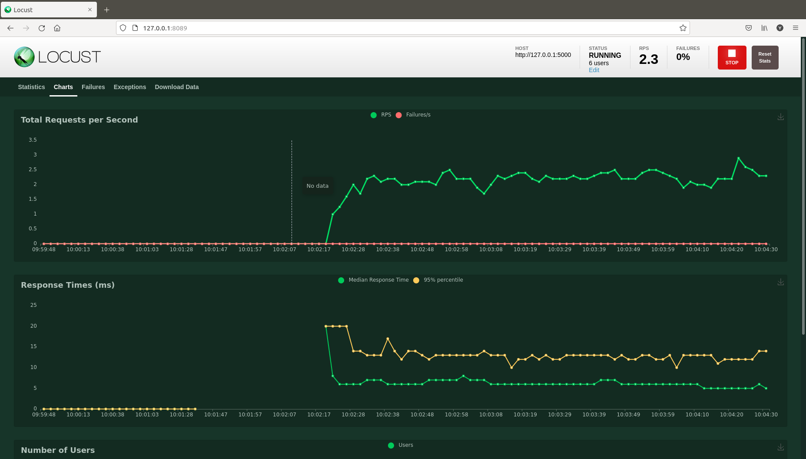
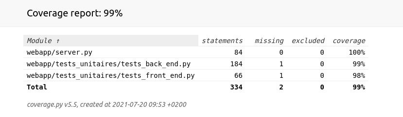

# Projet_P11

## Améliorez une application Web Python par des tests et du débogage

### 1) Description de l'application

Ce projet consiste à cloner le projet https://github.com/OpenClassrooms-Student-Center/Python_Testing, le debugger et implémenter les fonctionnalités attendues dans l'onglet Issues du projet source.

#### 1.1) Organisation du projet

A la racine du projet, on trouve :
- un package `webapp`contenant le code de l'application web "Güdlft Registration"
- un fichier `config.py` avec les paramètres de configuration de l'application
- un fichier `run.py` qui permet de lancer le serveur d'application
- un fichier `locustfile.py`et son fichier de configuration customisé `custom_locust.conf` qui permettent de lancer les tests de performance

Le package `webapp` contient :
- un dossier `static` avec les ressources statiques : code **Javascript** et code **CSS**
- un dossier `templates` avec les pages **HTML** du site
- un package `tests_integration`
- un package `tests_unitaires`
- les fichiers JSON : `clubs.json` et `competitions.json`
- un fichier `server.py` contenant les différentes vues (views) (fonctions exécutées en fonction des URL ou routes gérées par l'application web)

#### 1.2) GitFlow du projet

Le projet est organisé en 8 branches dont 6 dédiées aux bugs et améliorations :

- `01_amelioration_gestion_email_inconnu`
- `02_bug_clubs_using_more_points_allowed`
- `03_bug_booking_more_than_12_places`
- `04_bug_booking_places_in_past_competitions`
- `05_bug_point_updates_not_reflected`
- `06_feature_points_display_board`
- `main` : branche principale
- `QA` : branche audit qualité

### 2) Installation du projet Projet_P11 sur votre machine

Sur votre poste de travail, créer un dossier dans lequel vous allez installer le projet.

On nommera par exemple ce dossier `projects`. (vous pouvez le nommer autrement, c'est juste pour avoir une référence dans la suite des explications)

Aller sur le dépôt github : https://github.com/yannis971/Projet_P11

Pour l'installation, il y a 2 méthodes possibles.

#### 2.1) Première méthode : Téléchargement du fichier zip

Dans l'onglet **<> Code** de la page mentionnée plus haut, cliquer sur le bouton **Code** puis sur **Download ZIP**

Placer le fichier zip dans le dossier `projects` et le dézipper.

Ouvrir un terminal et se déplacer dans la racine du projet dossier `projects/Projet_P11-main/`

Passer à l'étape 3 pour configurer l'environnement virtuel

#### 2.2) Deuxième méthode : Clonage du dépôt avec git

Copier le lien https : https://github.com/yannis971/Projet_P11.git

Ouvrir un terminal et se déplacer dans le dossier `projects` créé précédemment et taper la commande :

`git clone` suivi du lien https copié plus haut.

soit : `git clone https://github.com/yannis971/Projet_P11.git`

Se déplacer dans la racine du projet : dossier `projects/Projet_P11`

Passer à l'étape 3 pour configurer l'environnement virtuel

### 3) Configuration de l'environnement virtuel

#### Remarque

Les commandes ci-dessous (notamment celles concernant l'installation de pip pour python3) sont valables sur un système d'exploitation Linux de type Debian ou de ses dérivés.

Pour Windows, on utilise python et pip.

Pour Mac OS, on utilise python3 et pip3.

#### 3.1) Installer pip pour python3 si ce n'est pas déjà fait

Si la commande `pip3 --version` renvoie une erreur alors il convient d'installer pip

`sudo apt-get update && sudo apt-get install python3-pip`

Si l'installation a réussi, la commande vous renverra une ligne comme indiqué ci-dessous

`pip 20.2.3 from /soft_desk/yannis/.local/lib/python3.8/site-packages/pip (python 3.8)`

#### 3.2) Créer un environnement virtuel et l'activer

Se placer à la racine du projet (dossier `projects/Projet_P11`) et lancer la commande :

`python3 -m venv env`

Une fois l'environnement virtuel `env` créé, l'activer avec la commande :

`source env/bin/activate`

#### 3.3) Installer les dépendances du projet

Toujours à la racine du projet, lancer l'une des 2 commandes suivantes :

`pip3 install -r requirements.txt`

`python3 -m pip install -r requirements.txt`

### 4) Exécution des tests

#### 4.1) Lancer le serveur d'application pour effectuer des tests manuels

Une fois l'environnement virtuel activé et les dépendances du projet Projet_P11 installées, en étant positionné dans le dossier `projects/Projet_P11`, exécuter la commande :

`python run.py`

Ouvrir dans un navigateur l'URL `http://127.0.0.1:5000/` et se connecter avec l'email d'un club défini dans le fichier `webapp/clubs.json`

#### 4.2) Exécuter les tests unitaires

Les tests unitaires sont implémentés à l'aide du framework `unittest`.

**Commande pour exécuter les tests Back End**

Le fichier `webapp/tests_unitaires/tests_back_end.py` permet de tester unitairement le code back-end (code Python contenu dans le fichier `webapp/server.py`)

Une fois l'environnement virtuel activé, en étant positionné dans le dossier `projects/Projet_P11`, exécuter la commande :

`python -m unittest webapp/tests_unitaires/tests_back_end.py`

Avec l'option `-v` (mode verbeux), on peut afficher la liste des tests exécutés :

`python -m unittest webapp/tests_unitaires/tests_back_end.py -v`

**Commande pour exécuter les tests Front End**

Le fichier `webapp/tests_unitaires/tests_front_end.py` permet de tester unitairement le code front-end (code Javascript contenu dans le fichier `webapp/static/js/booking-front-validation.py`).

Il n'est pas nécessaire de lancer au préalable le serveur d'application.

Les tests Front End héritent de la classe `LiveServerTestCase` du package `Flask-Testing` qui permet de lancer l'application sur un serveur de test.

Une fois l'environnement virtuel activé, en étant positionné dans le dossier `projects/Projet_P11`, exécuter la commande :

`python -m unittest webapp/tests_unitaires/tests_front_end.py`.

#### 4.3) Exécuter les tests d'intégration

Les tests d'intégration sont implémentés à l'aide du framework `pytest`.

Une fois l'environnement virtuel activé, en étant positionné dans le dossier `projects/Projet_P11`, exécuter la commande :

`pytest webapp/tests_integration/tests_utilisateurs.py -v`.

#### 4.3) Exécuter les tests de performance

Les tests de perfomance sont implémentés à l'aide du framework `locust`.

Compte-tenu du faible nombre de vues à tester, le code des tests de performance est placé à la racine de projet (`projects/Projet_P11`) dans le fichier `locustfile.py`

##### 4.3.1) Procédure pour exécuter les tests de performance manuellement

Une fois l'environnement virtuel activé, en étant positionné dans le dossier `projects/Projet_P11`, lancer le serveur d'application :

`python run.py`

Dans une autre invite de commande et dans le même environnement virtuel activé, exécuter la commande suivante dans le dossier `projects/Projet_P11` :

`locust`

Ouvrir dans un navigateur l'URL `http://127.0.0.1:8089/`

**Connexion**

Entrer les paramètres pour lancer les tests de performance :

Consulter les différents onglets

**Onglet Statistics**

**Onglet Charts**

**Onglet Failures**

**Onglet Exceptions**

**Onglet Download Data**

Vous pouvez télécharger les rapports que vous souhaitez analyser en cliquant sur les liens

**Rapport de tests Locust**

##### 4.3.1) Procédure pour exécuter les tests de performance en mode automatique

Une fois l'environnement virtuel activé, en étant positionné dans le dossier `projects/Projet_P11`, lancer la commande :

`locust --config=custom_locust.conf`

Les tests de performance sont configurés pour une durée de 30 secondes (`run-time = 30s`)

A l'issue des tests, les résultats (rapports) sont disponibles dans le dossier `locust_results`

### 5) Mesure de la couverture de code avec `coverage`

#### 5.1) Couverture de code avant

Une fois l'environnement virtuel activé, en étant positionné dans le dossier `projects/Projet_P11`, lancer dans l'ordre les commandes :

- `coverage erase`
- `coverage html webapp/server.py webapp/tests_unitaires/tests_back_end.py`

Renommer le répertoire `htmlcov` en `htmlcov-before` en tapant la commande :

`mv htmlcov/ htmlcov-before/`

Ouvrir la page `index.html` :

Les sources python peuvent être analysés en cliquant sur les liens correspondants.

#### 5.2) Couverture de code après

Une fois l'environnement virtuel activé, en étant positionné dans le dossier `projects/Projet_P11`, lancer dans l'ordre les commandes :

- `coverage run -m unittest webapp/server.py`
- `coverage run -m unittest webapp/tests_unitaires/tests_back_end.py`
- `coverage html webapp/server.py webapp/tests_unitaires/tests_back_end.py`

Le répertoire `htmlcov` contient les rapports de couverture de code après.

Ouvrir la page `index.html` :

Les sources python peuvent être analysés en cliquant sur les liens correspondants.

### 6) Licence

Le code de ce projet est sous licence libre **GNU GPL V3**

### 7) Questions/Aide/Support

En cas de problème ou pour toute question relative à ce projet, vous pouvez me contacter via l'un des canaux suivants :

* e-mail : yannis.saliniere@gmail.com

* twitter : https://twitter.com/YSaliniere

* rubrique "issues" du projet github : https://github.com/yannis971/Projet_P11/issues
